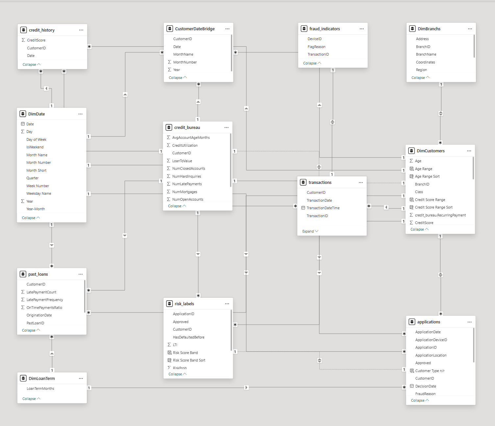

## 🟩 Power BI Dashboard Development

This section covers the development of the interactive dashboard, including data modeling, KPI creation, and visualization.

---

## 📅 Date Table (Power Query)

A dedicated date table was created in Power Query to provide a consistent time dimension for the model.

It includes standard attributes such as year, month, quarter, and weekday, enabling accurate filtering, time-based aggregation, and trend analysis across the dataset.

---

## 🧩 Data Modeling

A relational data model was designed to connect key datasets across the lending process, including customers, loans, transactions, and risk data. This structure enables consistent analysis of portfolio performance, credit risk, and fraud across the dashboard.

---

## 🧮 2. DAX Measures

DAX was used to define key business metrics and calculations.

Examples include:
- Approval Rate  
- Default Rate  
- Fraud Rate  
- Total Loan Amount  
- Average Loan per Customer  

👉 Full list of measures:  
See `dax_measures.md`

---

## 📊 3. Dashboard Visualizations

The final dashboard consists of the following views:

### Executive Summary  
- High-level overview of portfolio performance  

### Credit Risk Analysis  
- Risk distribution and default trends  

### Fraud Detection Insights  
- Fraud patterns across transactions  

### Customer Overview  
- Customer-level behavior and performance insights  
