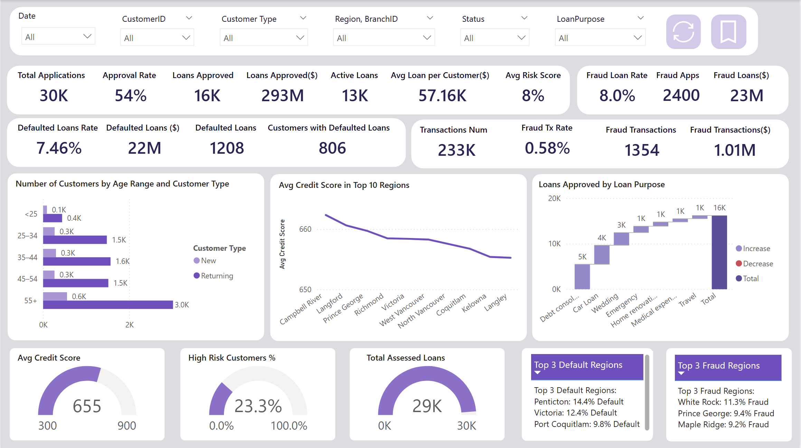
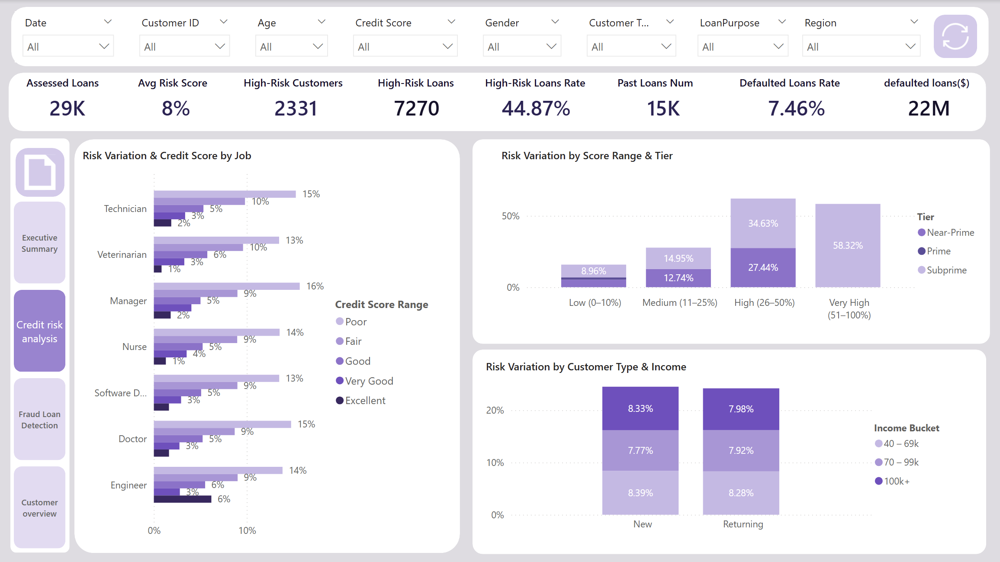
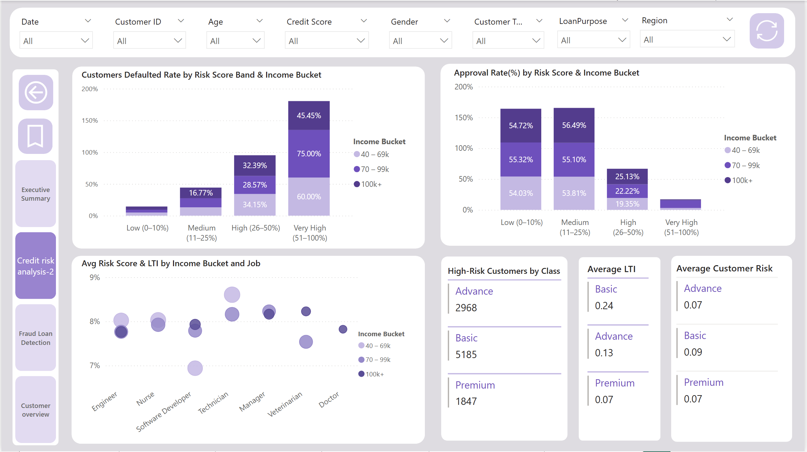
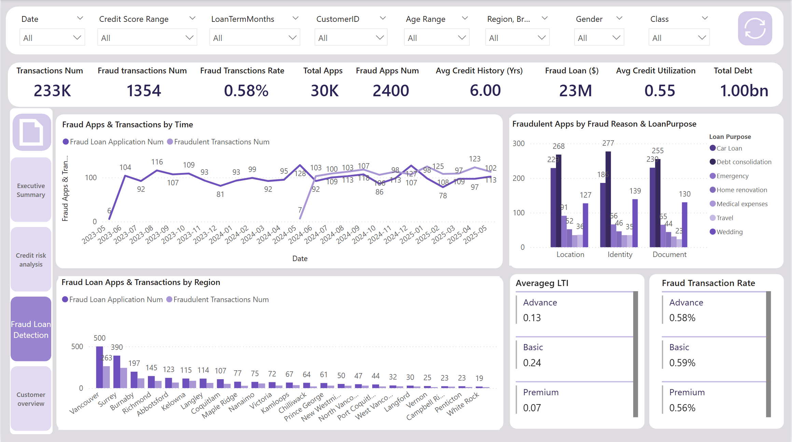
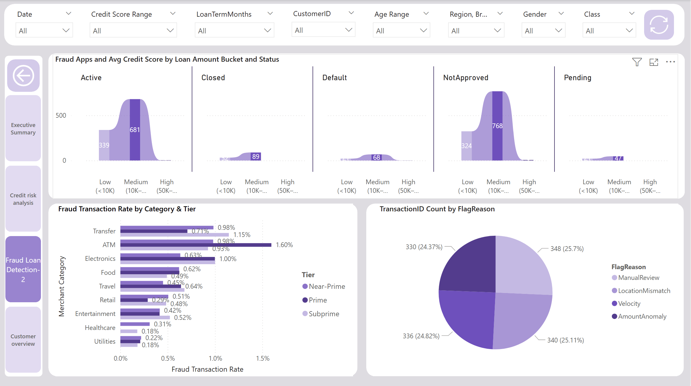
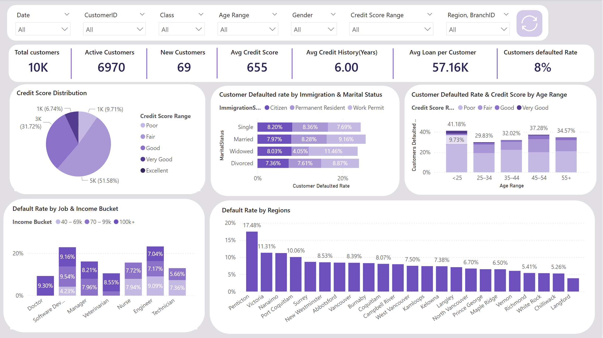

## 🟩 Power BI Dashboard Development

This section covers the development of the interactive dashboard, including data modeling, KPI creation, and visualization.The dashboard is designed for lending teams to monitor portfolio health, identify high-risk segments, and detect fraud patterns across the loan lifecycle.'

---

## 📅 Date Table (Power Query)

A dedicated date table was created in Power Query to provide a consistent time dimension for the model.

It includes standard attributes such as year, month, quarter, and weekday, enabling accurate filtering, time-based aggregation, and trend analysis across the dataset. The date table is marked as an official date table in Power BI and connected to ApplicationDate in the applications table.

---

## 🧩 Data Modeling

The data model follows a hybrid dimensional structure, combining star-schema principles with snowflake relationships and a dedicated bridge table. Core fact tables — transactions, applications, credit_bureau, risk_labels, and past_loans — connect to shared dimensions including DimCustomers, DimDate, and DimBranchs. A CustomerDateBridge table resolves many-to-many relationships between customers and dates across transaction and credit history records, while DimLoanTerm and credit_history extend the model through snowflaked connections.

---

## 🧮 DAX Measures

DAX was used to define key business metrics and calculations.

Examples include:
- Approval Rate  
- Default Rate  
- Fraud Rate  
- Total Loan Amount  
- Average Loan per Customer  

👉 Full list of measures:  
See `dax_measures.md`

---

## 📊 3. Dashboard Visualizations

The final dashboard consists of the following views:

### Executive Summary  
- High-level overview of portfolio performance

### Credit Risk Analysis  
- Risk distribution and default trends  

### Fraud Detection Insights  
- Fraud patterns across transactions  

### Customer Overview  
- Customer-level behavior and performance insights  

